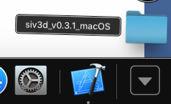
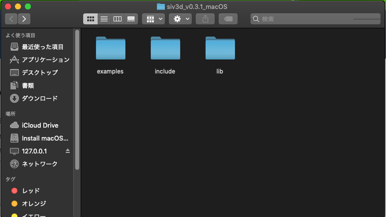
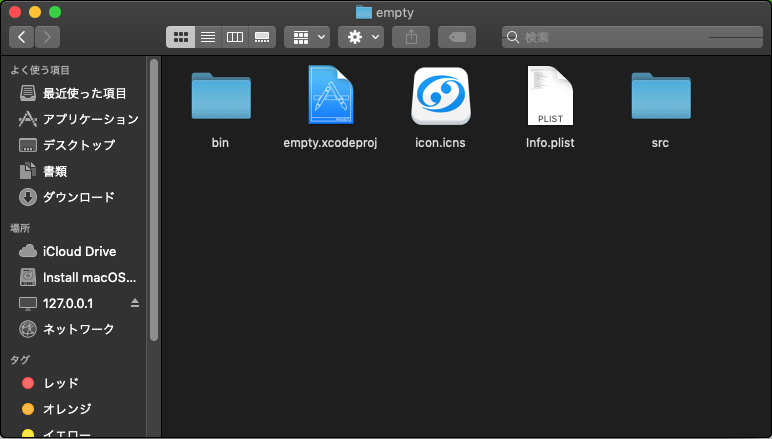
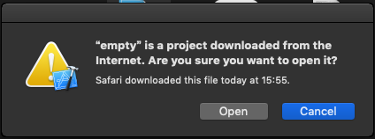
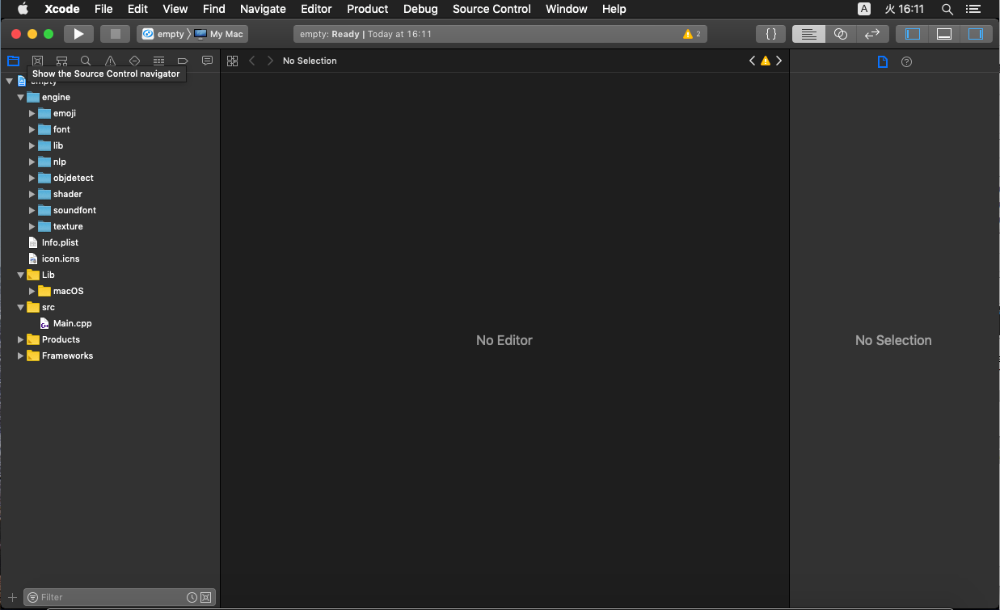

# OpenSiv3Dインストール方法

## 必要なもの
- Xcodeがインストール済みのMac
    - Xcodeがインストール済みでない場合は[Xcodeのインストール方法](https://misw.github.io/markdown/mis_xcode.html)を参照してインストールしてください。

## 手順
### ダウンロード
[公式のインストールガイド](https://scrapbox.io/Siv3D/OpenSiv3D_%E3%82%92%E3%81%AF%E3%81%98%E3%82%81%E3%82%8B%E6%BA%96%E5%82%99_(macOS))からOpenSiv3D v0.3.1 Project Templateをダウンロードしてください。(バージョン番号は記事作成時点です。インストール時点での最新を入れてください。)

### 展開
Safariでは自動で展開されるようですがChrome等でダウンロードした場合は展開されないため自分で展開する必要があります。

`OpenSiv3D v0.3.1 Project Template.zip`のようなファイルがダウンロードが終わったらzipファイルを展開します。Dockの右下のダウンロードなどからクリックすれば展開されます。

### 起動

展開されたフォルダの中でexamples>emptyの順でフォルダを開いてください。

`empty.xcodeproj` を開いてください。

このような起動して良いか確認するダイアログが出てきますがOpenを押して開いて大丈夫です。

無事プロジェクトが開かれればOKです。左のバーからMain.cppを選択すればソースコードを見られます。

左上にある再生ボタンのマークを押すとビルドが始まります。しばらく待っているとビルドが終わりサンプルが起動します。

### その他
もし他のゲームを作りたいなどの場合はもう一度ダウンロードするかzipを展開して別のフォルダを作る必要があります。
