# OpenSiv3Dの始め方(for windows)
この記事はC++のフレームワークOpenSiv3D(windows版)の始め方について解説した記事です。Macの方は[こちら](https://misw.github.io/markdown/mis_opensiv3d_mac.html)をご覧ください。
## OpenSiv3Dとは
OpenSiv3Dはプログラミング言語C++のゲーム制作やヴィジュアルプログラミングのためのフレームワークです。早稲田大学表現工学科博士課程の[Ryo Suzuki](https://twitter.com/reputeless)さんが中心となって開発されていいます。コンソールに文字を表示するのと同じような感覚で、図形,Emojiや様々な形式の画像を表示したり、効果音、BGMを鳴らしたりできます。その他、物理エンジン、QRコード読み取り、NintendoSwitchのJoyConの使用など様々な機能が用意されています。2019年3月時点ではVersion 0.3.1がリリースされていて、現在も開発が続いているフレームワークです。

## インストール方法
公式のリファレンスでも解説されていますが、画像多めで詳しく説明していきたいと思います。

### Visutal Studioのインストール

visual studioはMicorsoft社の統合開発環境(IDE)です。コードの自動補完(インテリセンス)など便利な機能が付いたエディタと、コードを機械語に翻訳してくれるコンパイラなどなど開発に便利な環境を用意してくれるソフトです。これがないと動かないのでインストールしてきます。

まず [Visual Stuido ダウンロードページ](https://visualstudio.microsoft.com/ja/downloads/)にアクセス https://visualstudio.microsoft.com/ja/downloads/
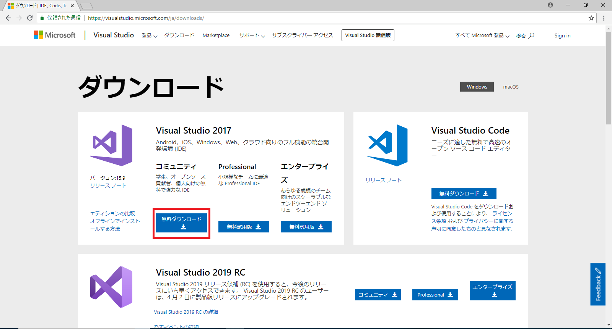
条件を満たす個人開発者であれば無償で使えるVisual Studio 2017 Communityをダウンロードします。(図中の赤枠内をクリック)

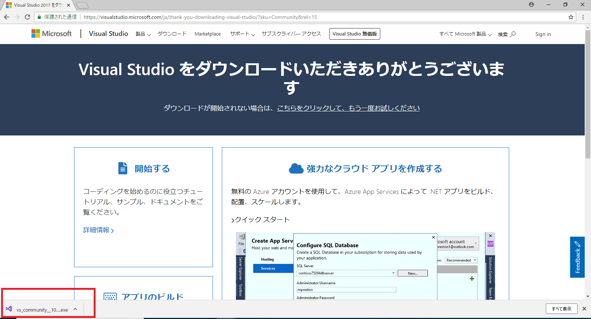
ダウンロードしたらChromeなどのブラウザの下部などにインストールされたものが表示されるのでそこをクリック

ライセンス条項に同意して続行

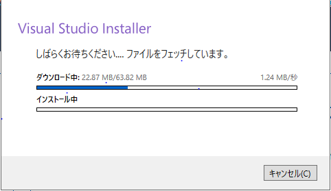
本体をインストールするためのインストーラーの構築が始まるので、準備ができるまで待ちます。

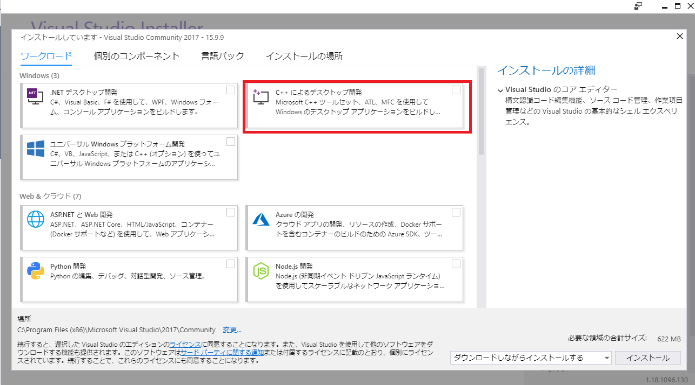
構築が完了すると、インストーラーが自動で立ち上がります。今回OpenSiv3DではC\+\+を記述することになるので、ワークロード「C++によるデスクトップ開発」をクリックしてチェック。

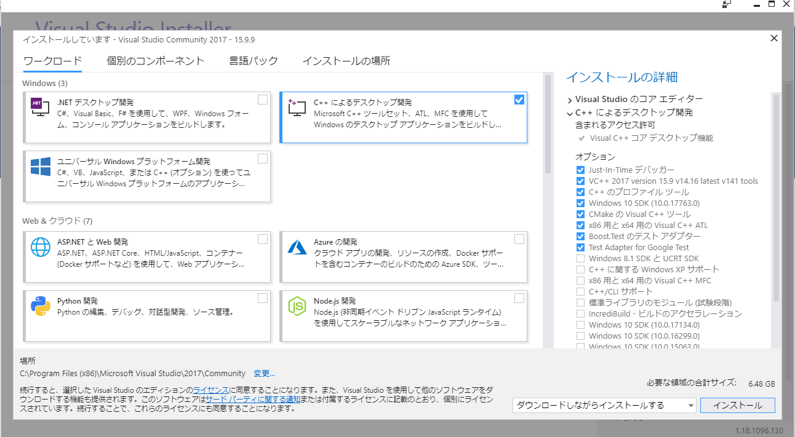
そして下部のインストールを押すと、パッケージのダウンロード/インストールが始まるので待ちます。

ダウンロード/インストール中はこんな画面になっています。

ダウンロード/インストールが終了すると、サインインを要求されます。とりあえず今回は後で行うことにします。

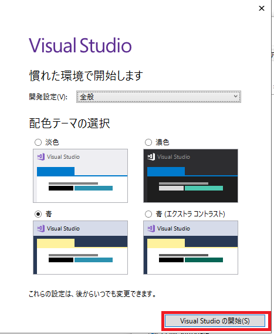
見やすいテーマを選択して「VisualStuidoの開始」

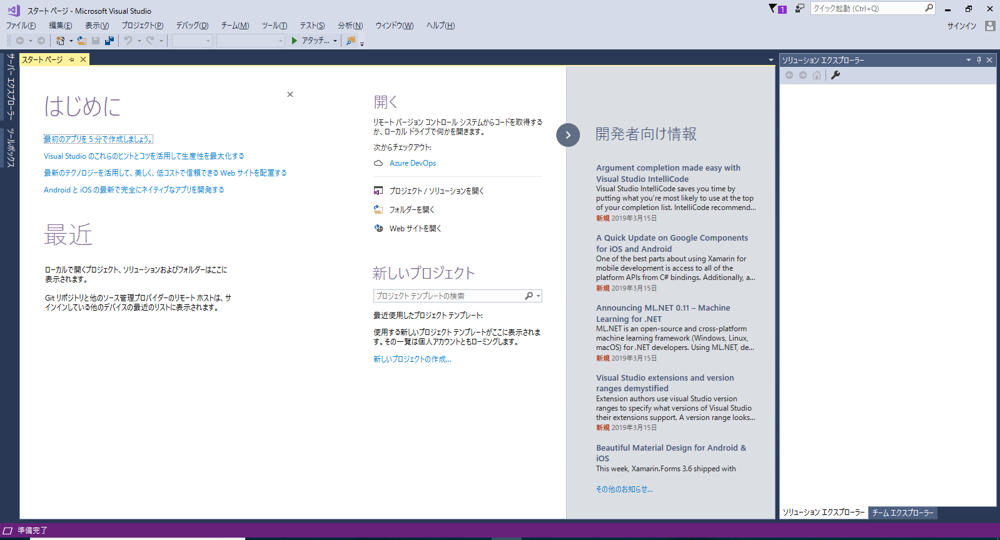
するとVisual Studioが開きます。これでひとまずVisual Stuidoのインストールは終了です。

---
---
---
### OpenSiv3Dのインストール
まず[こちら](https://scrapbox.io/Siv3D/OpenSiv3D_%E3%82%92%E3%81%AF%E3%81%98%E3%82%81%E3%82%8B%E6%BA%96%E5%82%99_(Windows))にアクセス https://scrapbox.io/Siv3D/OpenSiv3D_%E3%82%92%E3%81%AF%E3%81%98%E3%82%81%E3%82%8B%E6%BA%96%E5%82%99_(Windows)
こちらが公式のページなので、こちらにも当然インストールの仕方が載っています。
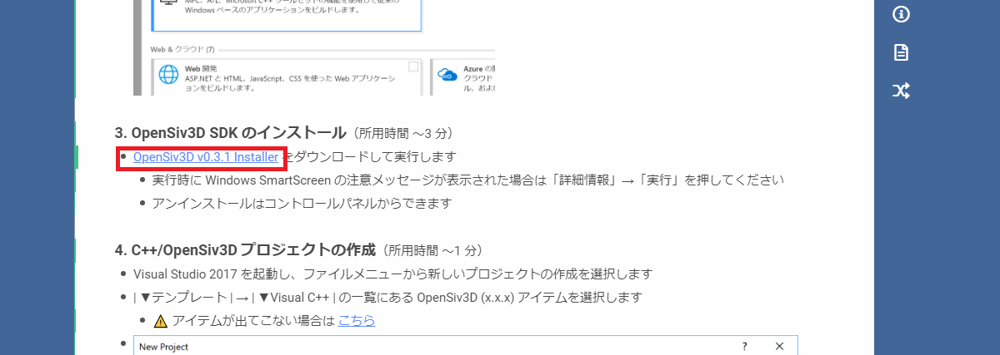
赤枠をクリックしてインストーラーをダウンロード。

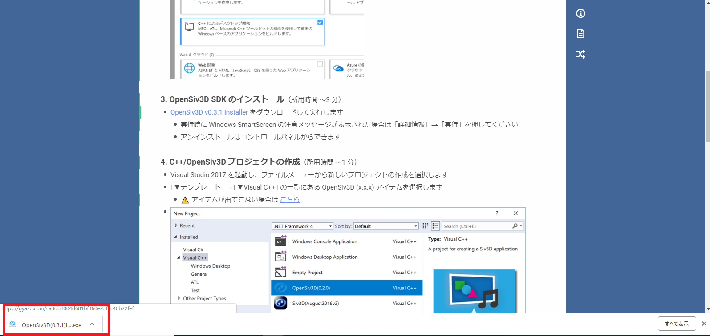
ブラウザ下部にダウンロードされたものが表示されるので実行。

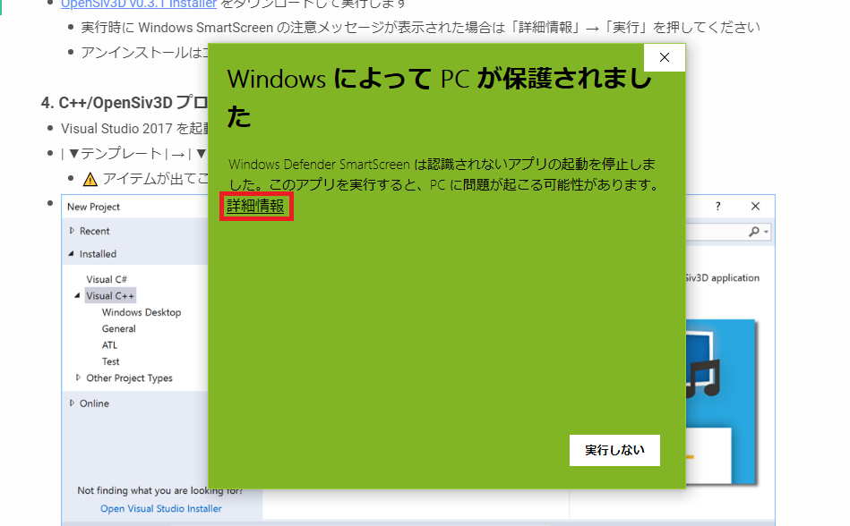
Windowsによって実行が止められた場合は詳細情報をクリック。

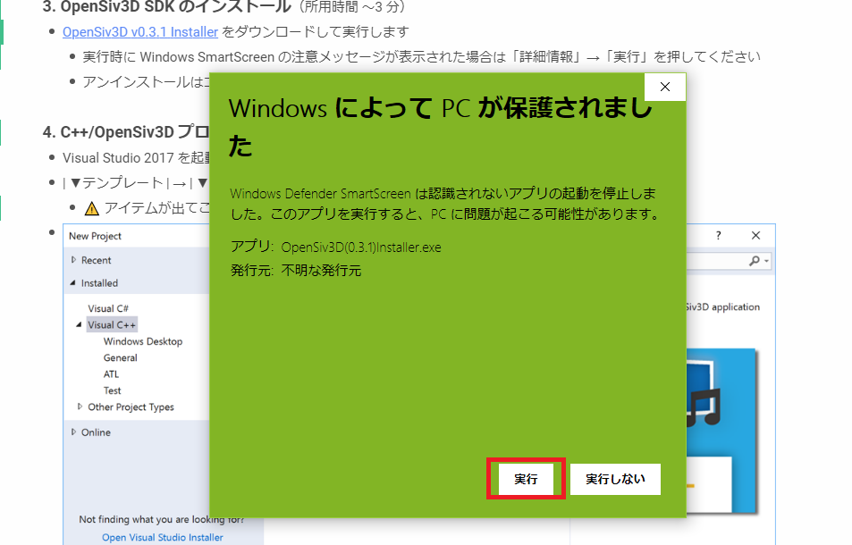
すると実行ボタンが現れるので実行。

インストール先を入力して実行(今回はデフォルトのインストール先のまま実行しました)

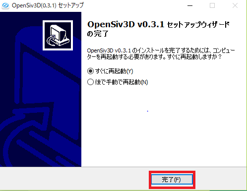
インストールが終了したらPCの再起動が必要になります。チェックを入れて「完了」。
再起動できたら、いよいよOpenSiv3Dを実行します!

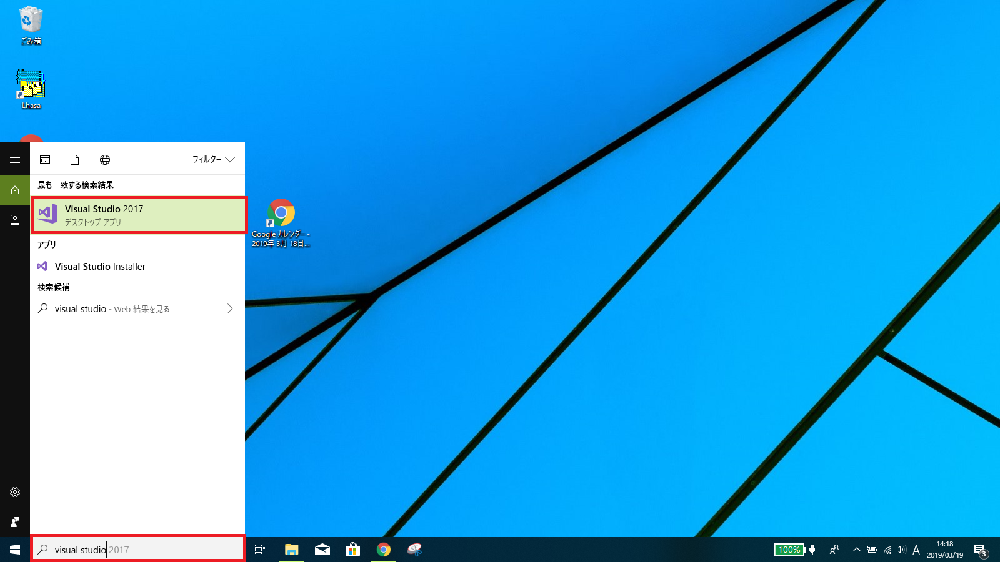
Windowsキーを押して「visual stuido」と検索してVisual Studio 2017を実行。

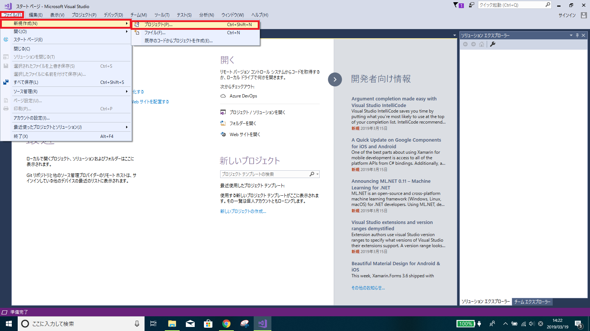
左上の「ファイル/新規作成/プロジェクト」をクリック

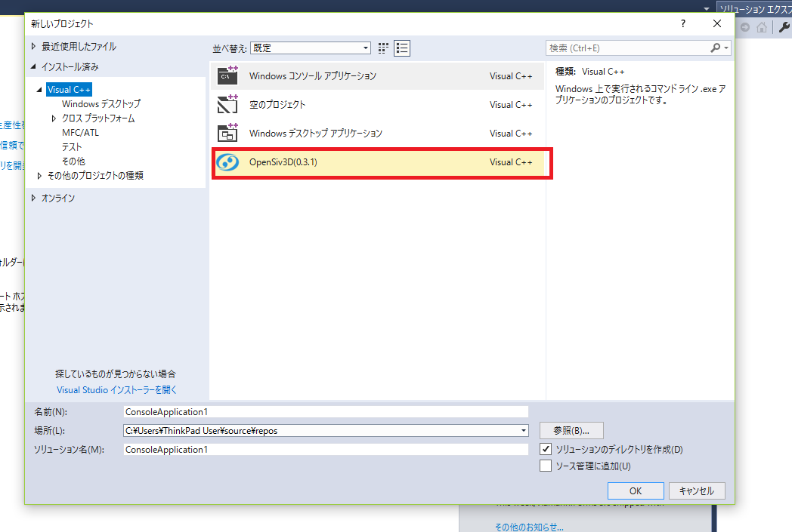
インストール済み/VisualC++にOpenSiv3Dのテンプレートが存在するので選択。

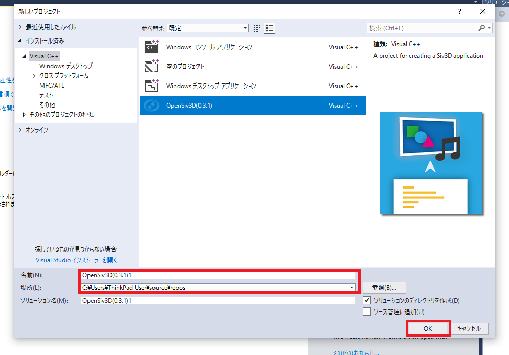
プロジェクト名とプロジェクトをつくるファイルを選択して(とりあえずはデフォルトのままでOK)、OKを押すと新たなプロジェクトが作成されます。

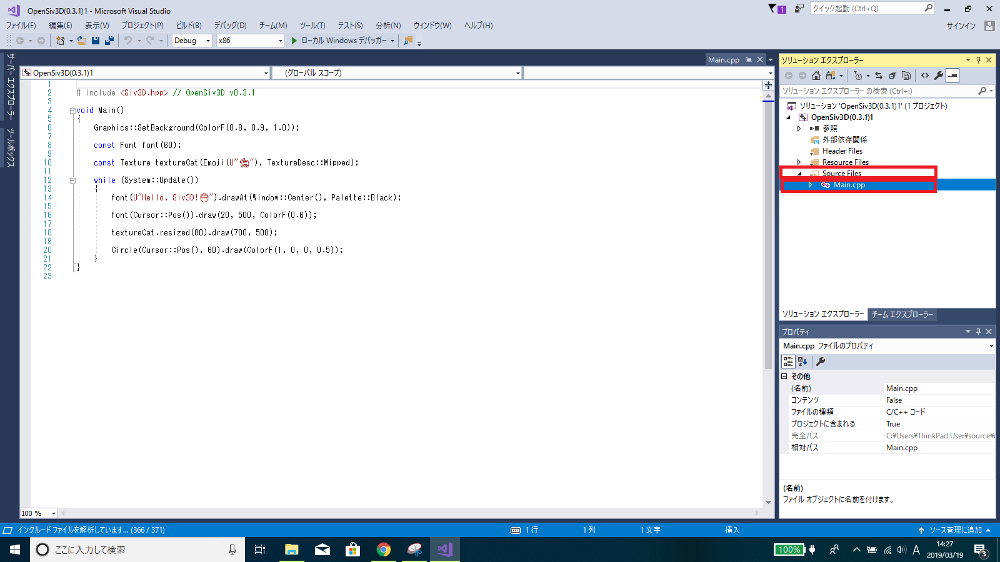
左側の「ソリューションエクスプローラー」の「Souce Files/Main.cpp」をダブルクリックして開くと、最初からサンプルコードが入っていることが確認できます。
このソースコードを実行してみましょう!!(コードの内容はまだわからなくて大丈夫です)

ここで「**F5**」キー(もしくは上の緑色の再生ボタン)を押すとプロジェクト全体がコンパイルされ、Main()という処理が開始されます。

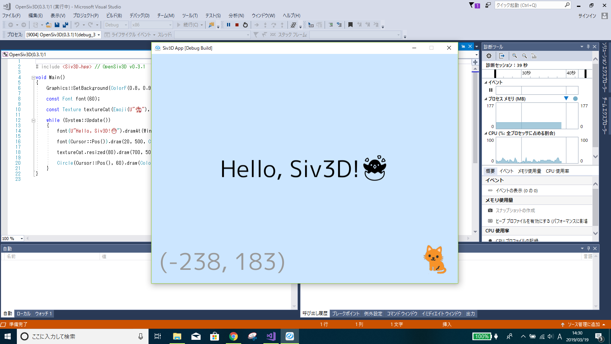
これで実行できました!!!環境構築お疲れ様です!!これであなたもOpenSiv3Dユーザーです!!

ソースコードの値や文字を別のものに変えてみて再び実行してみてください。変更した通りに動いていることが分かるでしょう!

## 参考文献

[OpenSiv3Dリファレンス](https://scrapbox.io/Siv3D/OpenSiv3D_%E3%82%92%E3%81%AF%E3%81%98%E3%82%81%E3%82%8B%E6%BA%96%E5%82%99)(Windows)
