# Git, SourceTree環境構築
---
## 1.Gitのインストール
### 1.1 インストーラのダウンロード
まず以下のサイトに飛んで、**Git for Windows Setup**の**64-bit Git for Windows Setup**.をクリックしてインストーラをダウンロードしてください。

https://git-scm.com/download/win

ダウンロードが完了したらインストーラを起動してください。

### 1.2 ライセンス確認

**Next**を押す。

### 1.3 インストール先フォルダの設定
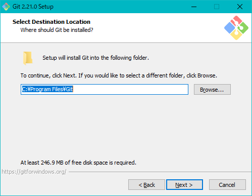

特にこだわりがなければそのままで**Next**。

### 1.4 コンポーネント選択
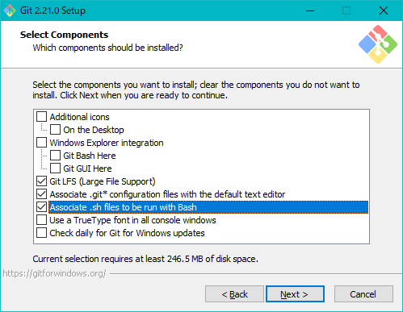

**Additional icons**はデスクトップにアイコンが欲しければチェックする。
それ以外はスクリーンショットの通りにチェックして**Next**。

### 1.5 スタートメニューに追加するフォルダ名

特にこだわりがなければそのままで**Next**。

### 1.6 エディタ選択
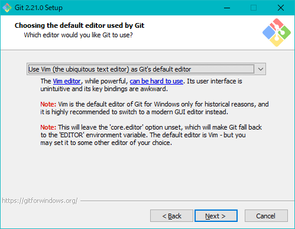

特にこだわりがなければそのままで**Next**。

### 1.7 環境変数に何を追加するか

コマンドプロンプトからGitコマンドを使用したいので**真ん中をチェック**して**Next**。

### 1.8 SSL通信の証明書の選択
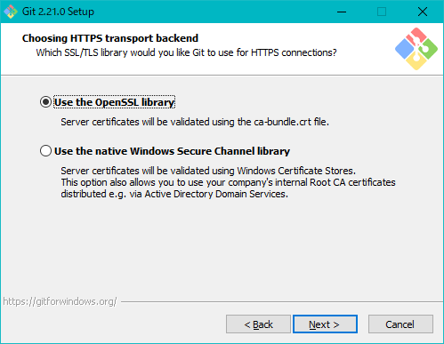

**OpenSSL**を選択して**Next**。

### 1.9 改行の取り扱い

gitに何も変更を加えさせない**一番下**を選択して**Next**。

### 1.10 コンソールの選択

**Windows標準のコマンドプロンプト**を選択して**Next**。

### 1.11 extra options
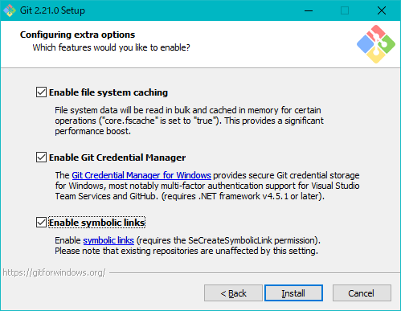

**すべてにチェック**を入れてインストール開始。

### 1.12 完了！
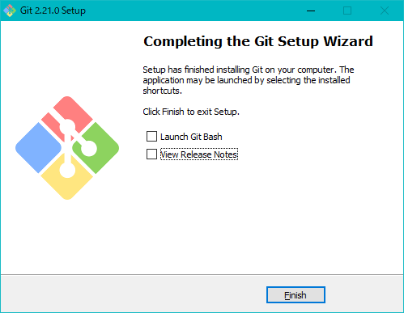

**Finish**を押してインストール完了。

---
## 2.SourceTreeのインストール(Windows版)
### 2.1 インストーラのダウンロード
以下のサイトに飛んで、**Download for Windows**をクリック。
ライセンスに関するチェックボックスが出てくるのでチェックしてダウンロード開始。
https://www.sourcetreeapp.com/

ダウンロードが完了したらインストーラを起動してください。

### 2.2 Atlassianのアカウント作成
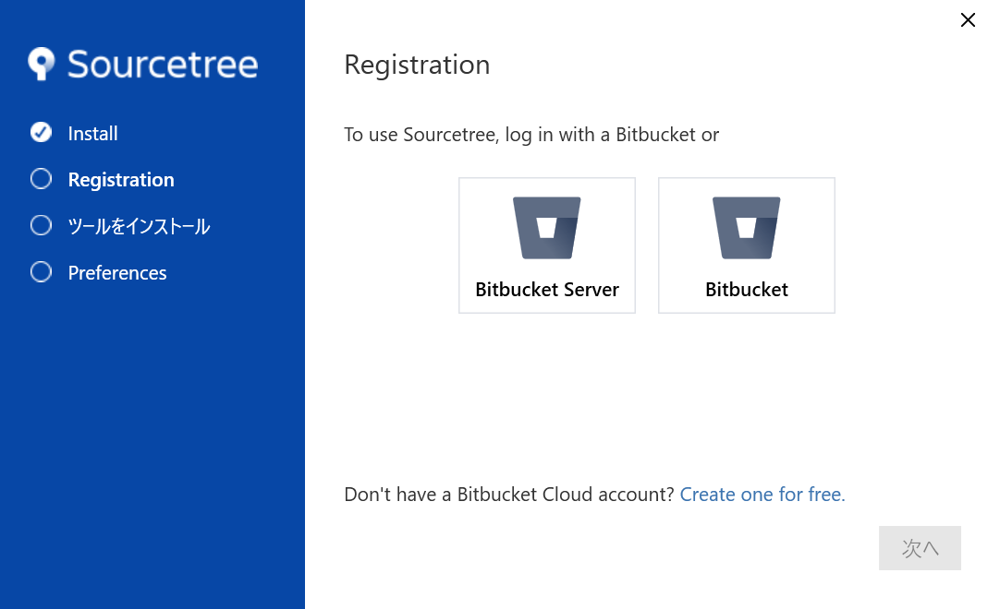

アカウントを持っていない人が大半だと思うので**Create one for free**をクリックして新規アカウントを作成する。

画面の指示に従ってアカウントを作成してください。
 

インストーラにこの画面が出れば成功です。

### 2.3 インストールするツールの選択

**Mercurial**は今回必要ないのでチェックを**外す**。

### 2.4 ユーザー情報
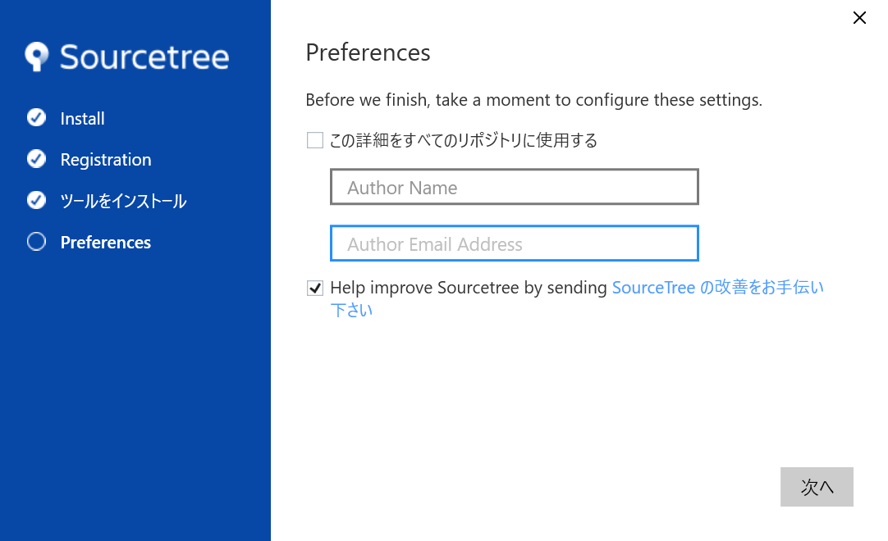

名前とメールアドレスを入力する。

### 2.5 SSHキーの登録
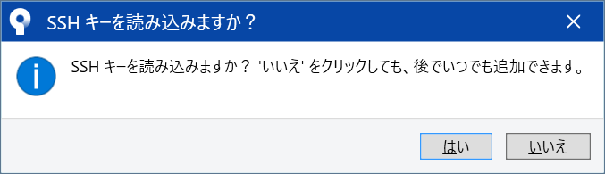

後で設定するのでひとまず**いいえを選択**。

### 2.6 完了！
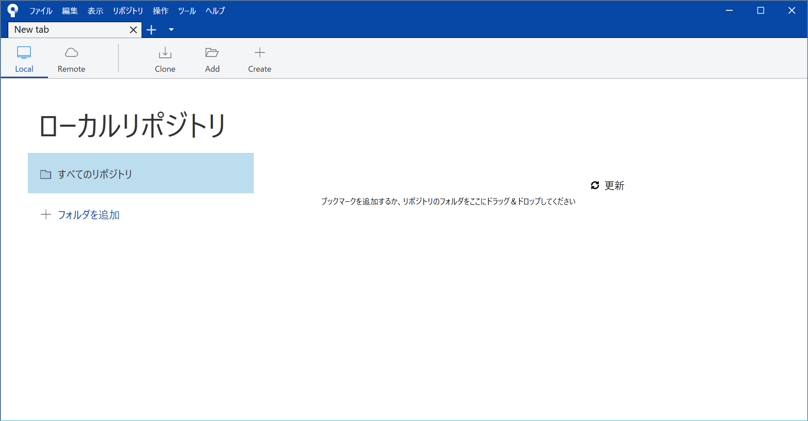

この画面が出たらSourceTreeのインストールは完了です。

---
## 3. GitHubとSourceTreeの連携(Windows版)
### 3.1 オプションを開く
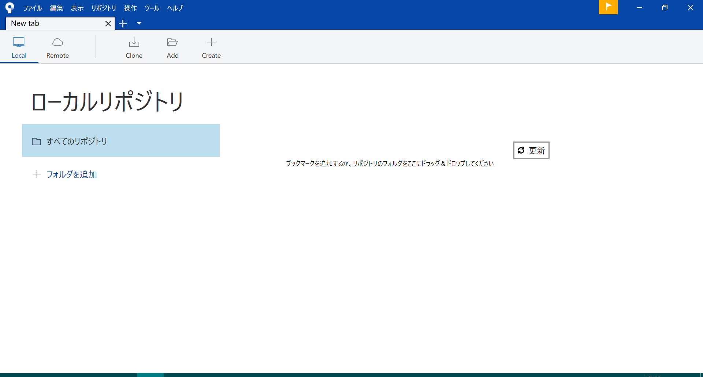
まず、上の**ツール**から**オプション**を開きます。

### 3.2 アカウントを追加する

**認証タブ**に移動して、**追加**をクリック。

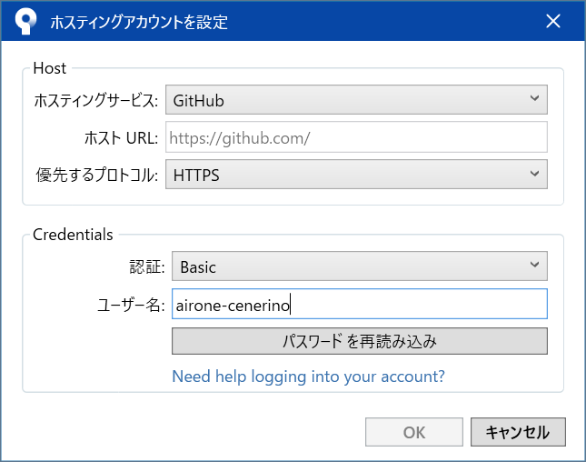
ホスティングサービスは**GitHub**、プロトコルは**HTTPS**、認証は**Basic**を選択する。
次に**GitHubの**ユーザー名、パスワードを入力する。
できたらOKを押す。

認証タブにこのようにアカウントが追加されていたら成功です。

## 4. SSH鍵の登録
### 4.1 Key Generatorを開く

上のバーの**ツール**から**SSHキーの作成/インポート**を押して、PuTTY Key Generatorを開く。

### 4.2 鍵の作成
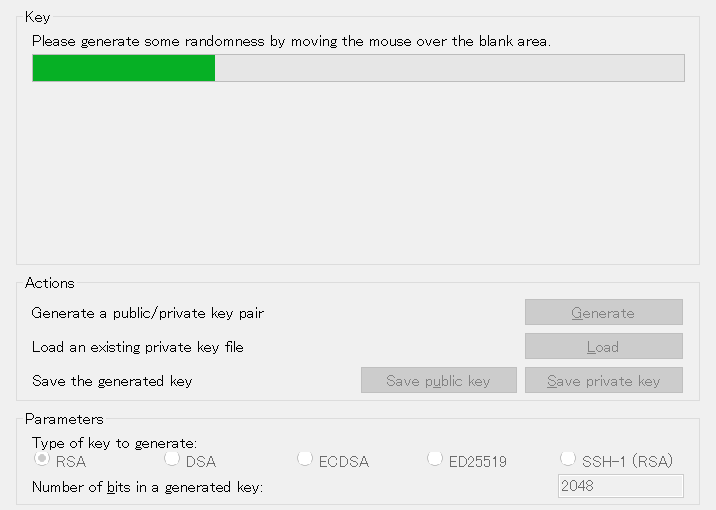
**Generate**を押して、上の緑色のバーが右に行くまでウィンドウ上で**ランダムにカーソルを動かす**。

### 4.3 秘密鍵の保存

Key passphraseは鍵自体にかけることのできるパスワードですが、今回は登録せずに進みます。
("パスワードをかけなくていいのか？"というウィンドウが出ますが、かけない方を選んでください)

**Save private key**を押して、**C:\Users\ユーザ名\\.sshディレクトリ**に**id_rsa.ppk**というファイル名で保存する。

### 4.4 公開鍵をGitHub上に保存

上の四角に囲まれているssh-rsaから始まる**文字列すべてをコピー**する。

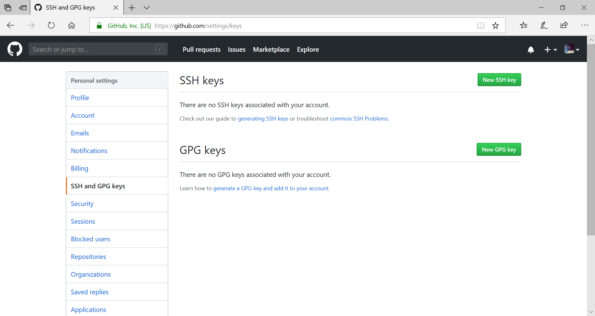
GitHubの**Setting**画面の**SSH and GPG Keys**タブを開く。
**New SSH Key**を押す。

Titleは適当に自分の分かる名前を付けて、Keyの下にコピーした**文字列を張り付け**て、**Add SSH key**を押す。

### 4.5 認証プロトコルの変更

**ツール**から**オプション**を開く。

**認証タブ**の**アカウント**の**編集**を押す。

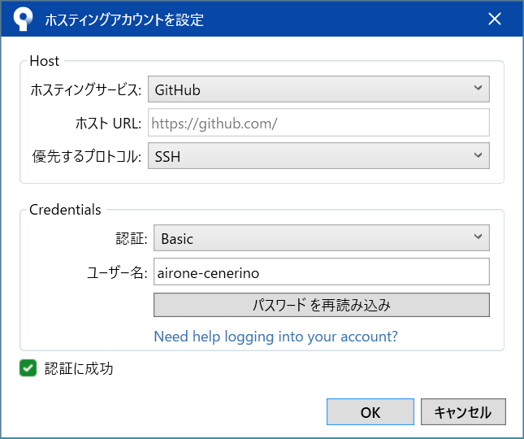
**優先するプロトコル**を**SSH**に変更する。
変更した後は**パスワードを再読み込み**を押して、**GitHubのパスワード**を打ち込んでください。

### 4.6 Pageantに秘密鍵を登録する
**ツール**から**SSHエージェントを起動**を押す。

スクリーン一番下のタスクバーにある^マークをクリックして、

このアイコンを右クリックして、Add Keyを押す。
**C:\Users\ユーザ名\\.sshディレクトリ**においた**id_rsa.ppk**ファイルを指定する。

これでSSHの設定は完了です！
