# Unity環境構築(Windows編)

## Visual Studio Community 2017のインストール方法
- Visual Studioとはマイクロソフト社が提供しているIDE(統合開発環境)です。中でもVisual Studio Community 2017は開発に便利な様々な機能を無料で使うことができます。
- https://visualstudio.microsoft.com/ja/vs/ から画像のように選択します。

- ダウンロードされたexeファイルを起動してVisual Studio Installerをインストールします。インストールが完了するとこのようになると思います。
- ぼくはもうVisual Studioを既に入れているのでこのようなスクショになっています(更新中)が、未インストールの人はインストールを選択するとインストールが始まります。

- Visual Studioを開くとこのような画面になると思います。これでVisual Studioのインストールが完了しました。

## UnityHub、Unityのインストール方法
- UnityHubは複数のUnityEditorのバージョン管理を簡単に行える便利なツールです。
- https://unity3d.com/jp/get-unity/download から「UnityHubをダウンロード」という所を選択すると、UnityHubSetUp.exeがダウンロードされます。ダウンロードが終わったらUnityHubSetUp.exeを開きましょう。

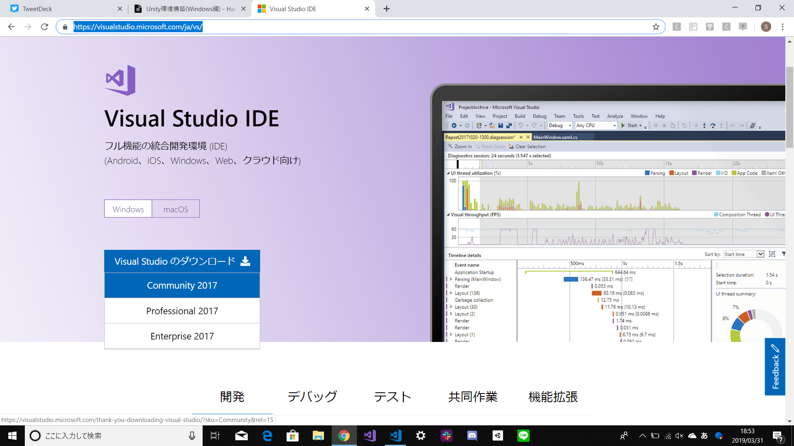
- 「同意する」を選択。

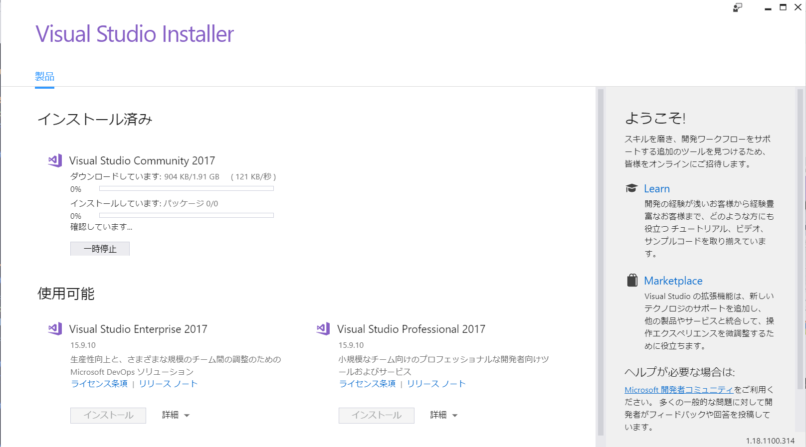
- 「インストール」を選択。

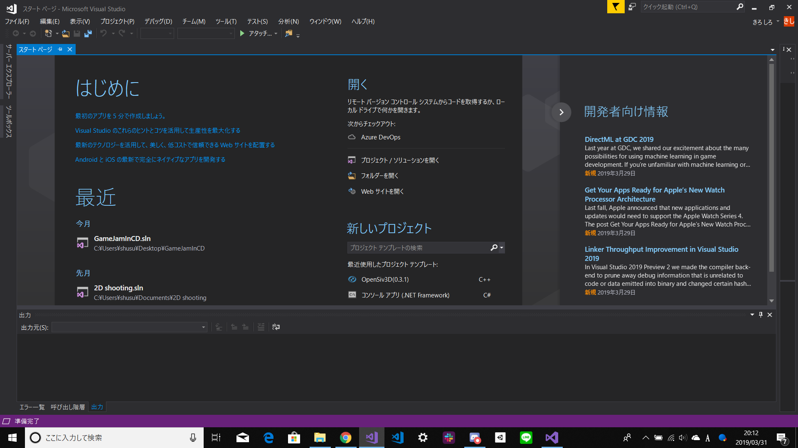
- 「完了」を選択。

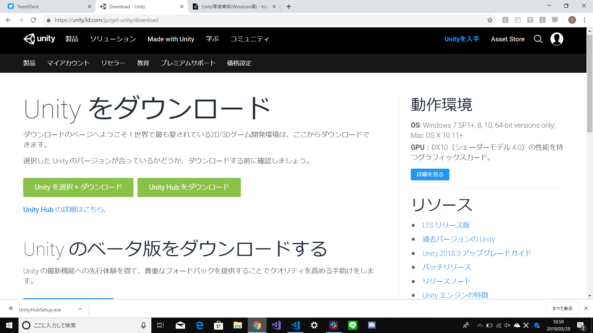
- このようなウィンドウが表示された場合は、「プライベートネットワーク」だけにチェックを入れましょう(スクリーンショットでは「パブリックネットワーク」にチェックを入れていますがこれはぼくのスクショミスです。騙されてはいけません...ごめんなさい)

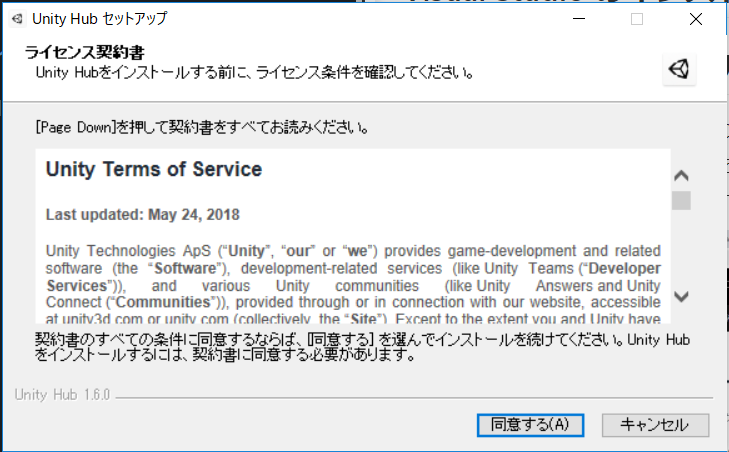
- UnityHubのインストールが完了しました。起動すると最初はこんな画面になっていると思います。UnityHubを用いることで、様々なバージョンのUnityを良い感じにまとめて管理してくれます。今はまだUnityがインストール出来ていないので、次にUnityHubからUnityをインストールしてみましょう。ここでは長期間サポートが保証されている最新のLTS版である「2017.4.24f1 LTS」をダウンロードします。

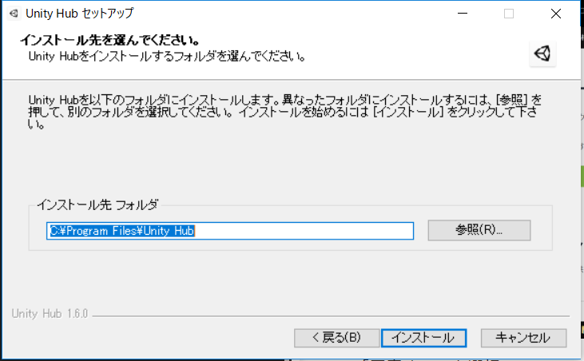
- 「Download」→「Unity 2017.4.24f1 LTS」を選択し、Unityをダウンロードします。
- Componentsのすべてにチェックを入れ、Dev tools,Platformsには何もチエックを入れずに「Done」を選択。

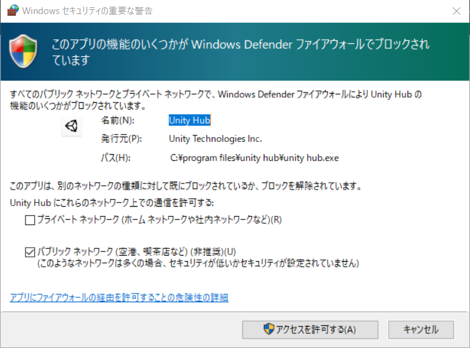
- Unityのインストールが完了しました。

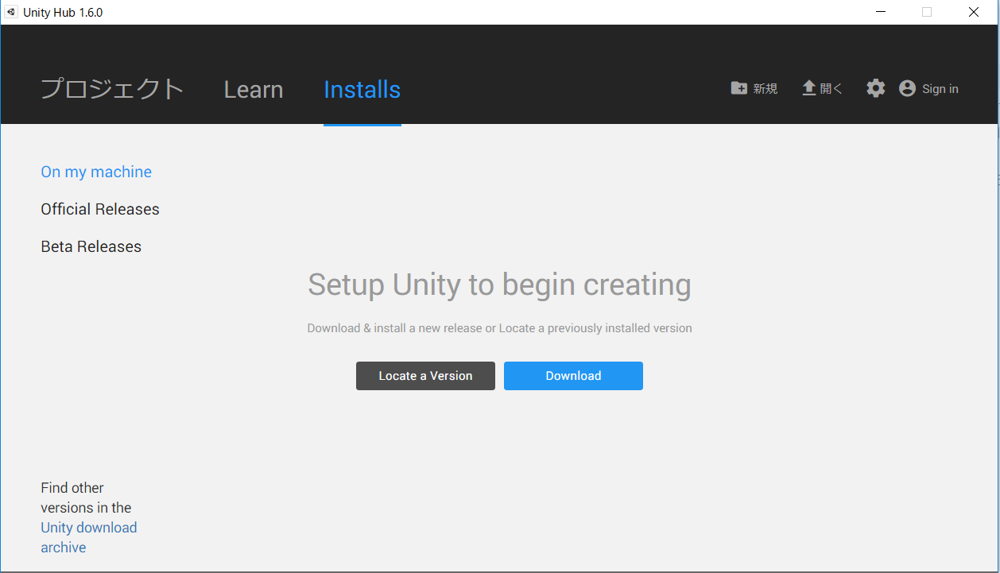

## プロジェクトの作成方法
- Unityでは1つのゲーム制作に対して1つのプロジェクトを作成し開発を行います。
- UnityHubを起動し、「新規」を選択しましょう。

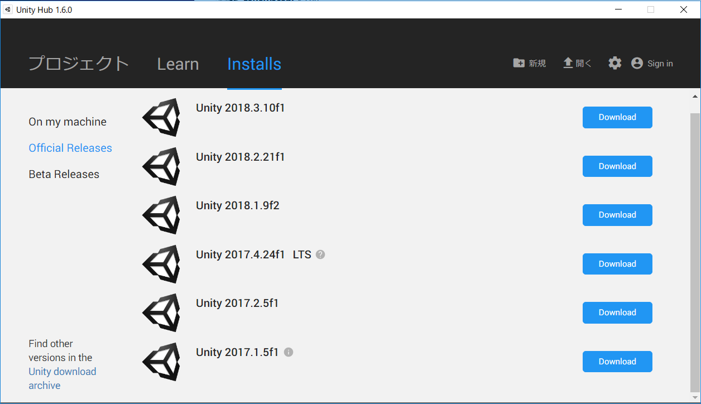
- Project nameでプロジェクトの名前を決めます。
- Unity Versionで使用するUnityのバージョンを選択します。
- Locationで作成するプロジェクトファイルのパスを変更できます。(特に変更しなくても問題ありません)
- Templeteで3Dゲームを作るか2Dゲームを作るかを選択します。

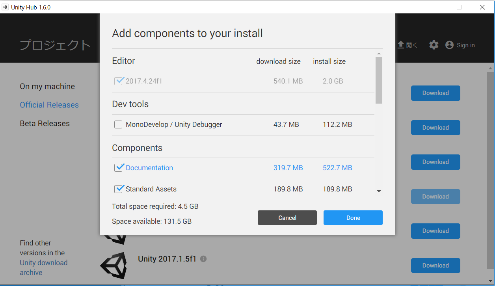
- プロジェクトが作成できました。

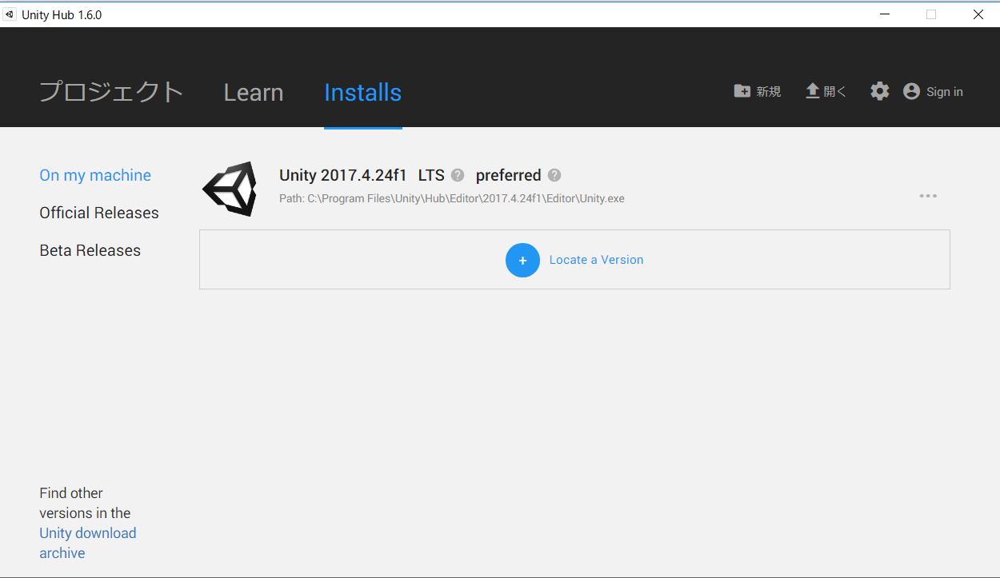

## UnityのデフォルトのエディターをVisual tudioにする
- Unityを開き、Edit → Preferencesを選択。
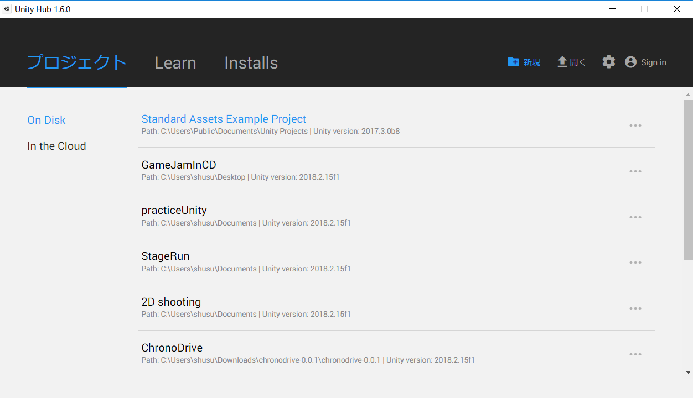
- External ToolsのExternal Script EditorをVisual Studio 2017(Community)に変更してください。以上で完了です。
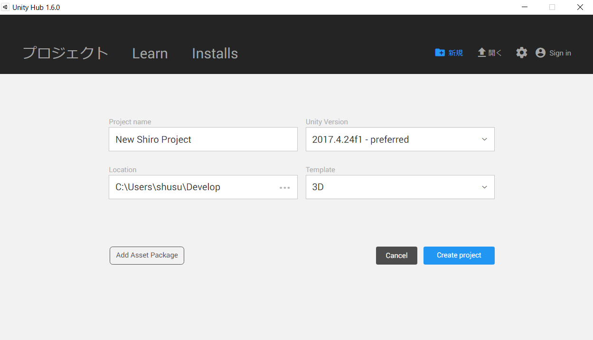

