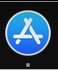
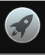
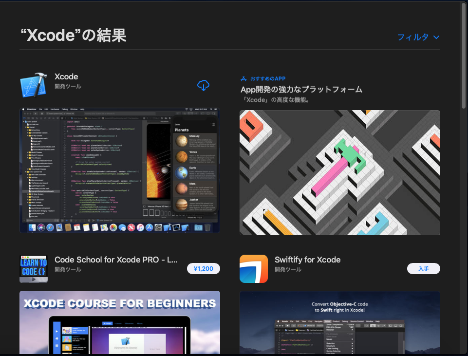
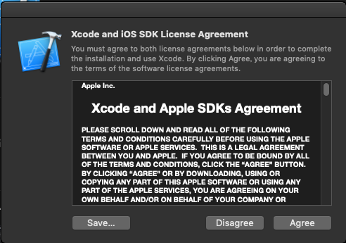

# Xcodeのインストール方法

## 必要なもの
- macOSの入ったMac
- Apple ID(Apple製品持っているなら普通は持っているはず)

## 注意
- 解説では最新バージョンのMojave(10.14.3)を前提で解説を進めます。
- Xcodeは古いmacOSのバージョンではインストールできないことがあります。アップデートしてください。
- Xcodeの容量は大きいためテザリングなどモバイル通信でインストールするのは非推奨です。

## 手順
### App Storeを起動する

以上のようなアイコンが下のDock(バー)にあればそれをクリックして起動。

なければ

以上のようなアイコンんがバーの左のほうにあるのでクリックし、左や右にスワイプして探してください。

### Apple IDでログイン 
- すでにログインずみの場合はこのセクションはスキップしてください
- 「ようこそMac App Store」といった文言が出てきたら「続ける」を押してください。

このような画面が起動したかと思います。

左下に自分のApple IDが表示されていない場合は「サインイン」をクリックしてログインしてください。

### Xcodeをインストールする
画面の左上に検索窓があるかと思います。クリックして `Xcode` と入力し、Enterを押して検索してください。

左上が今インストールしたい `Xcode` です。私のアカウントではすでにインストールしたことがあるので別のマークになっていますが、インストールしたことがなければ「入手」というボタンが表示されているかと思います。そのボタンをクリックしましょう。「インストール」というボタンに変わったらもう一度押しましょう。

おそらく再びApple IDのパスワード入力が求められるので入力して「入手」を押すとインストールが始まります。

### Xcodeを起動してみる

このようなライセンスに同意を求められる画面が出るので(同意できたら)Agreeを押しましょう。パスワードの入力が求められたら入力してください。
コンポーネントのインストールが始まります。