# Gitとは
Gitは **バージョン管理システム（Version Control System; VCS）** の1つで，ディレクトリ内のすべてのファイルの履歴を保存するためのソフトウェア。

# 使用例
## VCSのない世界
### 1.
たとえばまず `main.c` というファイルを作って以下のように書いたとする。
```c
{{#include snippets/main-1.c}}
```

### 2.
次に，4でしか割らないからゼロ除算のチェックは不要であったことに気づき，my_div関数を消したとする。
```c
{{#include snippets/main-2.c}}
```

### 3.
その数日後，割る数にargcを使うようにしたいと思い，以下のようにプログラムを修正したとする。
```c
{{#include snippets/main-3.c}}
```

ここでargcが1だとエラーになるから， **1.** で作った `my_div` 関数がほしい！でももう上書き保存してしまってもう一度書くしかない！となる。

### 4.
次から，このプログラマはプログラムに変更を加えるたびに **日付** （または連番）をつけて保存するようになる...
```bash
{{#include snippets/directory-manual-versioning.sh}}
```

## VCSのある世界
### 1.
まずターミナルで `git init` を打ってから作業を開始する
```shell
{{#include snippets/git-init.sh}}
```

### 2.
main.cを作って **git add** → **git commit**\
`-m "コミットメッセージ"` はコミットにつけるメッセージの指定で，あとで見返した時に何の変更をしたのかがすぐに分かるようにするためのもの。（必須）
```c
{{#include snippets/main-1.c}}
```

```shell
{{#include snippets/git-commit-1.sh}}
```

### 3.
main.cを編集して **git add** → **git commit**
```c
{{#include snippets/main-2.c}}
```

```shell
{{#include snippets/git-commit-2.sh}}
```

### 4.
ここで， **3.** で上書き保存して消えたmy_div関数をgitの履歴から取り出すために， **2.の時点でのディレクトリの状態を復元する**
```shell
{{#include snippets/git-log-and-git-checkout.sh}}
```

テキストエディタでmain.cを開くと，my_div関数が存在する。
```c
{{#include snippets/main-1.c}}
```

復元したmy_div関数をコピーできたら，最新の状態（my_div関数を消した後の状態）に戻る必要がある。そのためには以下のコマンドを打つ。
```shell
{{#include snippets/checkout-master.sh}}
```

### 補足
単に特定のコミットの時点でのファイルを閲覧するだけなら `git show` コマンドを使えば良い。
```shell
{{#include snippets/git-show.sh}}
```

## なぜファイルに日付を付けて保存していくのでは駄目なのか
1. VCSを使うと，変更が圧縮されて保存される
1. 保存対象からディレクトリ内の一部のファイル（コンパイル後の **実行可能ファイル** など）を自動で除くことができる
1. ファイル数が増えないため，ディレクトリが散乱しない
1. 各コミットで何を変更したのかを **コミットメッセージ** で確認できる
1. 誰が変更したのか，いつ変更されたのかが分かる
1. 複数人での履歴の共有が容易（後述）
1. 使ってないと時代遅れ

## 履歴はどこに保存されるのか
`git init` コマンドを打ったディレクトリに生成される  `.git`  というフォルダの中に保存されている。

## 以上の内容の動画
<video src="./assets/git-tutorial1.mp4" controls style="width: 60%"></video>

## コマンドを覚えられない
Gitはコマンドを打って使うものだという硬派な人も多いが， [GitHub Desktop](https://desktop.github.com/) , [GitKraken](https://www.gitkraken.com/), [SourceTree](https://www.sourcetreeapp.com/), [Fork](https://git-fork.com/) などのグラフィカルなツールを使ったほうが生産性が高い（個人的な意見です）。VSCodeなどのエディタに内蔵されている機能を使うのでも良い。

それぞれの比較:
- [GitHub Desktop](https://desktop.github.com/): 使うのが **一番簡単** だが高度な機能は（今のところ）用意されていない</li>
- [GitKraken](https://www.gitkraken.com/): 機能が多いが，初心者には少し難しいかもしれない。</li>
- [SourceTree](https://www.sourcetreeapp.com/): GitKrakenとほとんど同じ。</li>
- [Fork](https://git-fork.com/): 使っていないが，良いらしいと聞く。</li>

## 他のVCSは？
Gitは **2005年** に登場した比較的新しいVCS。以前は **subversion** や **Mercurial** などが使われていたが，今はgitの一人勝ち。

## GitHubとの違いは？
gitはバージョン管理システム。GitHubは **Microsoftの，** gitの履歴を複数人で共有するためのクラウドストレージ。

競合としてGitLab（GitLab Inc.）, GitBucket（Atlassian）などがある。

# Gitを使った共同編集
## bare git repository
複数のgitレポジトリ（ `git init` を実行したディレクトリ）を同期するには， **bare git repository** が必要。bare git repositoryは `git init --bare` で作成できる。

`git remote add <任意の名前>; <urlやファイルパスなど>;` で同期に使うbare git repositoryを追加できる。ここで追加したレポジトリを **リモートレポジトリ** という。 `git remote -v` で今までに追加したリモートレポジトリのリストを表示できる。なお，リモートではない（ `--bare` をつけずに初期化した）レポジトリは **ローカルレポジトリ** という。

`git push <リモートレポジトリに付けた名前>; master` でリモートレポジトリへファイルの変更履歴を送信できる。 `git pull <リモートレポジトリに付けた名前>; master` でリモートレポジトリにあるファイルの変更履歴を受信できる。

以下の動画ではそれを試している。左の段がローカルレポジトリ1，真ん中の段がリモートレポジトリ，右の段がローカルレポジトリ2。動画では，各ローカルレポジトリを異なるユーザーが使用すると想定して，user1, user2と名付けている。\
まず左の段のローカルレポジトリから右の段のレポジトリへgitの履歴を送り，次に逆方向も試している。\
`git push` を実行したときに中段のVSCode上のファイルに変化があることが分かる。\
なお，今回はbareレポジトリのディレクトリ名をremote-serverという名前にしたが，実際のプロジェクトでは慣習として.gitで終わる名前をつけることが多い。（例: remote-server.git）

<video src="./assets/git-tutorial2.mp4" controls style="width: 60%"></video>

## Gitホスティングサービス
複数人で作業する場合は， **リモートレポジトリ** が各ユーザーからアクセスできる場所（インターネット上）にないといけない。そのために **Gitホスティングサービス** を利用する必要がある。 **GitHub** はGitホスティングサービスのうちのひとつ。

たとえばGitHubで新しくレポジトリを作成すると，このように表示される。※レポジトリ名は加工してfoo/fooに変更しました\
なお， `git push -u` の `-u` は[上流ブランチ](https://git-scm.com/book/ja/v2/Git-のブランチ機能-リモートブランチ#r_tracking_branches)の設定を行うオプションで， `git pull` での省略記法を可能にする役割がある。


# コンフリクト
## コンフリクトと対処方法
複数人で同じファイルに同時に変更を加えると， **コンフリクト** が発生する。（下図を参照。text: xxxはファイルの中身がxxxであることを表す。）\


コンフリクトが起きると `git push` が実行できなくなる。そうなったら，一度 `git pull` を行った後にコンフリクトを解消してコミットし，もう一度 `git push` すればよい。（以下の動画を参照）

<video src="./assets/conflict.mp4" controls style="width: 60%"></video>

<!-- 
# 部分的なステージング
## git status
レポジトリ内のファイルは **Untracked** , **Unmodified** , **Modified** , **Staged** の4つのどれかの状態を持つ。\
各ファイルはデフォルトではUntracked（追跡されていない）。\
`git add` はファイルをStagedにする（ステージングする）コマンド。\
`git commit` はすべてのStagedであるファイルをコミットするコマンド。\
1つ前のコミットに含まれていたファイルは `Unmodified` になる。そこから変更を加えると `modified` になる。\
`git status` でファイルの状態を見ることができる。

## .gitignore
レポジトリ内に `.gitignore` という名前のファイルを作れば，ステージング対象にしないファイルを指定できる。
```bash
{{#include snippets/gitignore.txt}}
```

## 特定のファイルをステージングする
`git add <ファイル>;` でファイルを指定してステージング\
`git add <ディレクトリ>;` でディレクトリ内のすべてのファイルを（再帰的に）ステージング\
つまり， `git add .` はいまいるフォルダの中のすべてのファイルをステージングすることを意味する。

## git add --patch
`git add --patch` を使えばファイルの一部分をステージングできる。 -->


<!-- # ブランチ
## ブランチを使った開発
ブランチを使わないとコンフリクトが頻発する。ブランチを分けると良い。
（TODO: git branch, git checkout -b の説明）

## HEADとcheckout
HEADが現在いるブランチ（やコミット）を指す。checkoutでHEADを移動させられる。
（TODO: デモ）

## fetchとリモート追跡ブランチ
`git fetch` はリモートのすべてのブランチを **リモート追跡ブランチ** へダウンロードする。リモート追跡ブランチはリモートレポジトリのブランチのコピーで， `origin/master` など。
（TODO: リモートブランチをgit branchコマンドで確認する）

## pullと追跡ブランチ
ブランチに上流ブランチを設定して **追跡ブランチ** にすると， `git pull` と打つだけで持ってこれる。 `git branch -vv` で追跡ブランチを確認できる。\
`git branch -u origin/master` のようにして上流ブランチを設定できる。 `git clone` などのコマンドが自動的に追跡ブランチを設定することがある。

## blob, tree, refs
ブランチの実体はrefs。refsはコミットを指す。コミットはtree（スナップショット）を指す。treeはそのスナップショットに含まれるファイル（= blob）の一覧を指す。\
`git update-ref` とかで編集できる。

## merge, rebase, cherry-pick
mergeはマージコミットを作ってマージする。rebaseはブランチをレベース先にブランチの後ろへ移動させる。cherry-pickは別のブランチの特定のコミットを適用する。

## タグ
`git tag -a -m "メッセージ"` で作る


# GUIを使ったレポジトリの操作
TODO

# GitHubの使い方
TODO

# その他の機能
git stash, submodules, git configとか -->
