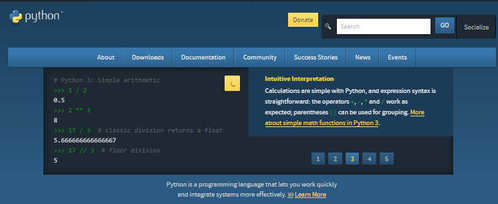
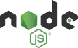
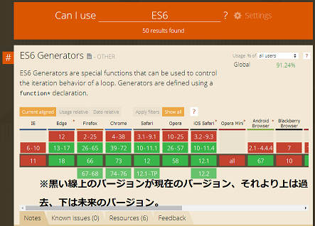

# インストールしよう
## Pythonのインストール
<a href="https://ja.wikipedia.org/wiki/Python">Python</a>は動的型付け言語のひとつ。

以下のような実装がある。

<a href="https://www.python.org/">CPython</a>
\
最もよく使われる実装。今回はこれを使う。

<a href="http://pypy.org/">PyPy</a>
<br>
CPythonよりも実行速度が速い。その代わり起動は遅い。
※ PyPyのロゴは Samuel Reis によります。


<div>
  インストールは
  <a href="https://www.python.org">CPythonの公式サイト</a>からインストーラをダウンロードして行う。Python2とPython3があるが、2は古いため3を使う。<br>
  ※ 左図はCPythonのホームページのスクリーンショット
</div>

ネット上にはPythonのインストールにAnacondaを使うことを推奨している記事があるが、Anacondaは初心者が使うと問題が起きるため推奨しない。また、上記サイトからインストールする場合は先にアンインストールしておくこと。

## Node.jsのインストール
<a href="https://ja.wikipedia.org/wiki/JavaScript">JavaScript</a>はブラウザやNode.jsで動かすことのできる言語。実装にはV8やSpiderMonkeyなどがある。


<div>
  <a href="https://nodejs.org/ja/">Node.jsの公式サイト</a>でインストーラーをダウンロードできる。
  公式サイトにはLTSとCurrentの2つのバージョンがある。
  <a href="https://en.wikipedia.org/wiki/Long-term_support">LTS</a>はLong-term supportの略で、安定版のこと。このページにあるサンプルプログラムはLTSでしか動作確認していないため、LTSを推奨する。
</div>

# ファイルから実行してみる
## Pythonをファイルから実行してみよう
好きな場所に `main.py` というファイルを作って、以下の内容を書き込む
```python
{{#include snippets/2/py_hello.py}}
```

コマンドプロンプト（ターミナル）を開いて、 `py 今作ったファイルのパス` と打つ
（例:  `py C:\Users\foo\main.py` ）\
※ MacOSやLinuxの場合は、 `py` の部分を `python3` で読み替えてください。\
以下のように表示されたら成功。
```plaintext
{{#include snippets/2/py_hello_result.txt}}
```

## JavaScript (Node.js) をファイルから実行してみよう
好きな場所に`main.js`というファイルを作って、以下の内容を打ち込む
```javascript
{{#include snippets/2/js_hello.js}}
```

コマンドプロンプト（ターミナル）を開いて、 `node 今作ったファイルのパス` と打つ
（例:  `node C:\Users\foo\main.js` ）\
以下のように表示されたら成功。
```javascript
{{#include snippets/2/js_hello_result.txt}}
```

## JavaScript (ブラウザ) をファイルから実行してみよう
JavaScriptファイルをブラウザ上で実行するにはHTMLファイルが必要。\
好きな場所に `index.html` というファイルを作って、以下の内容を打ち込む
```html
{{#include snippets/2/browser_hello-index.html}}
```

 `index.html` と同じフォルダ内に `main.js` というファイルを作って、以下の内容を打ち込む
```javascript
{{#include snippets/2/browser_hello-main.js}}
```

ブラウザ（Internet Explorerだとうまく実行できない可能性があるため、Microsoft EdgeやGoogle ChromeやMozilla Firefoxなどの他のブラウザを使用してください。）を開き、 `index.html` ファイルをブラウザへドラッグ

開発者ツールを開いて、出てきたパネル上でConsole (コンソール) タブを開いて、以下のように表示されていたら成功。\
（開発者ツールの開き方はOSによります。LinuxやWindowsでは `F12` や `Ctrl+Shift+I` などで開けます。）
```javascript
{{#include snippets/2/browser_hello-result.txt}}
```

# REPLを実行してみる
## REPLとは
多くの言語には<a href="https://ja.wikipedia.org/wiki/REPL">REPL (Read-Eval-Print Loop)</a>が存在する。

> C#ならcsi、Javaならjshell、Goならgore、Rubyならirb、...

REPLを使うと、ファイルを用意せずに短いコードを簡単に実行できる。\
REPL上では、入力した式の計算結果を `print` や `console.log` を使わなくても表示してくれる。

## PythonのREPLを実行しよう
コマンドプロンプト（ターミナル）を開いて、 `py` と打つ\
※ MacOSやLinuxの場合は、 `python3` と打ってください。

以下のように打つ。
```python
{{#include snippets/3/py_repl_hello.py}}
```

いろいろ入力してみてください。（ `f(10)`  や `2 + 4` など）

## JavaScript (Node.js) のREPLを実行しよう
コマンドプロンプト（ターミナル）を開いて、 `node` と打つ

以下のように打つ。
```javascript
{{#include snippets/3/node_hello.js}}
```

いろいろ入力してみてください。（ `f(10)`  や `2 + 4` など）

## JavaScript (ブラウザ) のREPLを実行しよう
ブラウザ（Microsoft EdgeやMozilla FirefoxやGoogle ChromeやInternet Explorerなど）を開き、F12キーを押す\
※ 空のタブを使ってください。

Console (コンソール) タブを開き、以下のように打つ。
```javascript
{{#include snippets/3/console_hello.js}}
```

いろいろ入力してみてください。（ `f(10)`  や `2 + 4` など）

# テキストエディタ

<div>
  テキストエディタにはMicrosoftが開発している、<a href="https://nodejs.org/ja/docs/">VSCode</a>を使うのがおすすめです。<br>
  起動が速くて高機能です。<br>
  特に、VSCodeはTypeScript（後述）で開発されているのもあって、TypeScriptを使うならVSCodeを使うべきです。<br>
  拡張機能の
  <a href="https://marketplace.visualstudio.com/items?itemName=ms-python.python">Python</a>
  <a href="https://marketplace.visualstudio.com/items?itemName=ms-vscode.vscode-typescript-tslint-plugin">TSLint</a>
  を入れて使うべきです（※ TSLintは廃止予定で、将来的にESLintへ移ります）。他にも、
  <a href="https://marketplace.visualstudio.com/items?itemName=msjsdiag.debugger-for-chrome">Debugger for Chrome</a>, <a href="https://marketplace.visualstudio.com/items?itemName=streetsidesoftware.code-spell-checker">Code Spell Checker</a>なども入れるといいと思います。（細かい使い方はネットで調べてください。）
</div>

# Python, JavaScriptの学習方法
## バージョンについて
PythonもJavaScriptも活発に開発されていて、アップデートが速いです。\
そのため、ネット上のサイトや本を見るときはどのバージョンを対象にした記事なのかに注意しないと、コードが動かなかったり、古くて今は使われていない手法だったりします。

Pythonのバージョン\
<table>
  <tr><th>バージョン</th><th>リリース年</th></tr>
  <tr><td>1</td><td>1994</td></tr>
  <tr><td>2 (2.0 ~ 2.7)</td><td>2000</td></tr>
  <tr><td>3 (3.0 ~)</td><td>2008</td></tr>
</table>

> ※ Python 2は2020年にサポートが終了した。
> 現時点での最新は3.7で、2018年にリリース。

JavaScriptのバージョン\
<table>
  <tr><th>バージョン</th><th>リリース年</th><th>主な新機能</th></tr>
  <tr><td>ES3</td><td>1999</td><td></td></tr>
  <tr><td>ES4</td><td>リリース無し</td><td></td></tr>
  <tr><td>ES5</td><td>2009</td><td>strict mode, Arrayのメソッド追加</td></tr>
  <tr><td>ES2015 (ES6)</td><td>2015</td><td>let, const, class, Arrayのメソッド追加, アロー関数, テンプレート文字列, for~of, Promise, ...</td></tr>
  <tr><td>ES2016</td><td>2016</td><td>累乗演算子, Arrayのincludesメソッド</td></tr>
  <tr><td>ES2017</td><td>2017</td><td>async/await</td></tr>
</table>

## Pythonを学習しよう
CPythonの公式サイトがチュートリアルを用意してくれています。必ず読みましょう。\
<a href="https://docs.python.org/ja/3/tutorial/index.html">https://docs.python.org/ja/3/tutorial/index.html</a>\

理解できない部分がある場合、人に聞くか、本を買ってみるのもよいかもしれません。

## JavaScript (ブラウザ) を学習しよう
ブラウザの1つであるMozilla Firefoxを開発しているMozillaが、<a href="https://developer.mozilla.org/ja/">MDN (Mozilla Developer Network)</a>でJavaScriptのドキュメントを公開しています。

> MDNのWebチュートリアル: <a href="https://developer.mozilla.org/ja/docs/Web/Tutorials">https://developer.mozilla.org/ja/docs/Web/Tutorials</a>

ただ、このチュートリアルは少し読みづらいので、他のサイトを見るか本を買った方が良いかもしれません。
とくにこちらのサイトがおすすめです: <a href="https://uhyohyo.net/javascript/">uhyohyo.net/JavaScript初級者から中級者になろう</a> （名前に反して、JavaScriptを全く知らない方にも良いサイトです。）

ブラウザ上で複数のJavaScriptファイルを組み合わせて使う場合、WebPackやParcelが必要になります。（使わなくてもできるが、大変）\
JavaScriptはInternet Explorerではまともに開発できません（動作が重いことや、JavaScriptのバージョンが古いことなどが原因）。他のブラウザを使いましょう。

## JavaScript (Node.js) を学習しよう
Node.jsは基本的にターミナル上で動作するため、ブラウザ上でJavaScriptを実行するときに使える `document` や `alert` などの画面の表示に関する変数・関数が存在しません。\
その代わりに、主にサーバーに関わる、Node.js専用の多くの機能が提供されています。<a href="https://nodejs.org/ja/docs/">Node.jsのドキュメント</a>で確認できます。\
Node.jsにはパッケージマネージャであるnpm (Node Package Manager)が付属しています。（Pythonのpipに相当）

## JavaScriptの古い書き方について
JavaScriptは下位互換性を保ちながらアップデートされているため、今はまず使われない古い書き方が多く存在します。それらの一部をここで示しておきます。

関数
```javascript
{{#include snippets/5/function.js}}
```

変数
```javascript
{{#include snippets/5/variable.js}}
```

クラス
```javascript
{{#include snippets/5/class.js}}
```

ブロックスコープ
```javascript
{{#include snippets/5/block.js}}
```

# 型を付けよう
PythonやJavaScriptは動的型付け言語であり、変数に型がありません。\
これは不便なことが多いので、型付けする方法が用意されています。積極的に使っていくべきです。

## Pythonの型アノテーションを使う
Pythonでは型アノテーションを使って型を明示的に指定できます。
使い方はCPythonの公式ドキュメントを参照: <a href="https://docs.python.org/ja/3/library/typing.html">https://docs.python.org/ja/3/library/typing.html</a>

例
```python
{{{#include snippets/6/typed.py}}
```

## TypeScriptを使う
JavaScriptにはTypeScriptを使って型を付けられます。TypeScriptはJavaScriptに型を指定する文法を加えた言語で、JavaScriptに変換されてから実行されます。
<a href="http://www.typescriptlang.org/play/">TypeScriptの公式サイトのPlayground</a>ではブラウザ上で簡単にTypeScriptを試せます。

Node.jsでTypeScriptを使う場合、 `ts-node` が便利です。
コマンドプロンプト（ターミナル）上で `npm install -g ts-node typescript` と打つとts-nodeがインストールされます
（ts-nodeの使用にはtypescriptのインストールも必要）。
あとは、 `ts-node ファイル名` と打てば、TypeScriptのファイルを実行できるはずです。\
（内部的には、TypeScriptのファイルがJavaScriptに変換されてからNode.jsで実行されます。）

> ※  `ts-node` コマンドが存在しないと表示された場合は、<a href="https://qiita.com/yuki12/items/9723f60907508b11504b">PATHを通す</a>必要があります。Windowsの場合は `%APPDATA%\npm` を追加すればよいです。

TypeScriptファイルをJavaScriptに変換するには、以下のコマンドをコマンドプロンプト（ターミナル）上で打ちます。
```shell
{{#include snippets/6/tsc_usage.sh}}
```

`main.ts` のようなファイルを作り、コードを書き、コマンドプロンプト（ターミナル）上で `npx tsc` と打てば、TypeScriptからJavaScriptへ変換されます。

TypeScriptでは、変換先のJavaScriptのバージョンが低いときJavaScriptのいくつかの最新の機能（Arrayの関数やMapなど）を使えません。
`tsconfig.json` の `"target"` を `"ES2017"` などに変更すれば使えるようになります。

**TypeScriptはJavaScriptとほぼ同じ** です。最低限覚えるべき文法を記しておきます。
細かい使い方はサンプルプログラムを見てください。
これを読んだら、次に<a href="https://qiita.com/uhyo/items/da21e2b3c10c8a03952f">TypeScriptの型初級</a>を見ることをお勧めします。

> TypeScriptはJavaScriptさえ分かっていれば学習コストが低いことが特徴なので、とりあえずは軽く使ってみて、興味が出たらTypeScriptの型初級を読むといいです。

```typescript
{{#include snippets/6/ts_syntax.ts}}
```

# クロスブラウザ対応について


各ブラウザのJavaScriptのバージョン（実装状況）は<a href="https://caniuse.com/">caniuse.com</a>などで確認できます。\
例えばES2015 (ES6)を使えるかは、<a href="https://caniuse.com/#search=ES6">https://caniuse.com/#search=ES6</a> で確認できます。
これを見ると、IE (Internet Explorer) ではES6をほとんど使えないことがわかります。
現在は<a href="https://babeljs.io/">Babel</a>などを使ってES2015以降のコードをES5以前のコードに変換して対応するのが主流です。

> （TypeScriptはデフォルトではES5のコードに変換されます。）

# サンプルプログラム1: かんたんなサーバー
## この節について
ためしに簡単なプログラムを書いて、各言語の雰囲気を感じてもらうために書きました。\
パッケージマネージャの使い方を示すために、意味もなく外部ライブラリを持ち出しています。

PythonやNode.jsのコードは、実行環境やライブラリのアップデートで動かなくなることがあります。もし最新バージョンの環境で動かなかったら、このページの管理者に報告してください。\
今回は入門のため省略しますが、実際には `package-lock.json` (各ライブラリのどのバージョンを使うかが書かれたファイル) で対処できます。

## パッケージマネージャとは
Pythonにはpip、Node.jsにはnpmというパッケージマネージャが付属している。\

パッケージマネージャは外部ライブラリのダウンロードに使うツールで、pipなら<a href="https://pypi.org">pypi.org</a>、npmなら<a href="https://www.npmjs.com/">npmjs.com</a>からダウンロードしてくる。\
pipではダウンロードしたファイルはPC全体から呼び出せるが、npmでは `-g` オプションを付けないとき特定のフォルダ内からのみ呼び出せる。\
各ライブラリにはたいてい多くの依存ライブラリが存在して、1つのライブラリを `install` すると同時にそのライブラリが依存している多くのライブラリが自動でダウンロードされる。\

ライブラリを使うときは、必ずライセンスを確認すること。（MITとかBSDとかGPLとか）

## Python
まずpipを使って必要なライブラリをインストールする。VSCodeを使う場合、
1. 空のフォルダを好きな場所に作る
1. もしVSCodeで既に別のフォルダを開いていたら `Ctrl+K -> F` で閉じる
1. `Ctrl+K -> Ctrl+O` からフォルダを開く（あるいはコマンドプロンプト上で `code フォルダへのパス` ）
1. `Ctrl+Shift+@` でコマンドプロンプト（ターミナル）を開いてコマンドを打つ（ ターミナルの種類の切り替えは  `Ctrl+Shift+P`  ->  `select default shell`  からできます。）

> エラーがおきたら：\
> `pip` コマンドが存在しないと表示された場合は、 `py -m pip` （MacOSやLinuxでは `python3 -m pip` ）を使ってください。\
>  Windowsで「アクセスが拒否されました」と表示される場合、コマンドプロンプトを<a href="https://qiita.com/takuya0301/items/df6cde3bbaf9e13ef8f0">管理者権限で開いて</a>もう一度実行してください。\

> `pip` コマンドでダウンロードしたファイルは、バージョンやOSによって異なりますが、Windowsでバージョン3.7なら `C:\Program Files\Python37` 下らへんに置かれます。\
> インストールしたパッケージの一覧は `pip list` で見れます。

```shell
{{#include snippets/8/pip_install.sh}}
```

次に、ファイル `main.py` （名前は何でもよい）を作って、以下のように書く。
> 一行目で今インストールしたFlaskを呼び出しています。\
> `/` にアクセスしたら"Index Page"と訪問者数、 `/foo` にアクセスしたら"Foo Page"を表示するプログラムです。
```python
{{#include snippets/8/flask_sample.py}}
```

`py main.py` （あるいは `python3 main.py` ）で実行した状態で、<a href="http://localhost:3000/">http://localhost:3000/</a>を開くと"Index Page"と訪問者数、<a href="http://localhost:3000/foo">http://localhost:3000/foo</a>を開くと"Foo Page"と表示される。

## JavaScript/TypeScript
まずnpmを使って必要なライブラリをインストールする。VSCodeを使う場合、

1. 空のフォルダを好きな場所に作る
1.もしVSCodeで既に別のフォルダを開いていたら `Ctrl+K -> O` で閉じる
1. `Ctrl+K -> Ctrl+F` からフォルダを開く（あるいはコマンドプロンプト上で `code フォルダへのパス` ）
1. `Ctrl+Shift+@` でコマンドプロンプト（ターミナル）を開いてコマンドを打つ（ターミナルの種類の切り替えは `Ctrl+Shift+P`  ->  `select default shell` からできます。）

> npmを使うには、最初に `npm init -y` での初期化が必要です。
> これによって、カレントディレクトリ下に `package.json` ファイルが生成されます。\
> `npm install` を使うと、ライブラリをダウンロードできます。ライブラリは `-g` を付けなかった場合カレントディレクトリ下の `node_modules` フォルダ内に置かれます。中を見ると多くのファイルが存在することを確認できると思います。\
> TypeScriptで外部ライブラリを使うときには、同時に型定義ファイル（.d.tsで終わる名前を持つファイル）が必要になります。 `@types/ライブラリ名` として型定義ファイルが配布されている場合が多いです。

```shell
{{#include snippets/8/init_express.sh}}
```

次にファイル `main.ts` （名前は何でもよい）を作って、以下のように書く。ただし、1.でコマンドを打ったディレクトリにファイルを置くこと。\
> 一行目で先ほどインストールしたexpressをインポートしている。\
> TypeScriptでは、JavaScriptの `const X = require("Y")` を `import X = require("Y")` と書く必要がある。
```typescript
{{#include snippets/8/express_sample.ts}}
```

`ts-node main.ts` で実行した状態で、<a href="http://localhost:3000/">http://localhost:3000/</a>を開くと"Index Page"と訪問者数、<a href="http://localhost:3000/foo">http://localhost:3000/foo</a>を開くと"Foo Page"と表示される。

このままだと、 `console.log` の部分に `Calls to 'console.log' are not allowed.tslint(no-console)` という警告がでます。\
無視してもいいですが、ディレクトリ内のtslint.jsonの"rules"に以下のように一行足せば消えます。
```json
{{#include snippets/8/edit_tslint.json}}
```

## 何をしたのか
自分のPCが接続されているLAN内からのみアクセスできるサーバを作りました。\
自分のプライベートIPアドレスがわかれば、他のPCからもアクセスできます。\
コマンドプロンプトでipconfig（MacOSやLinuxならifconfig）と打ち、 `192.168.` や `10.` や `172.` で始まるアドレスを探してください（複数ありますが、"IPv4アドレス"や"inet"となっているものです）。
これがプライベートアドレスなので、たとえば `192.168.2.104` だったら、<a href="http://192.168.2.104:3000">http://192.168.2.104:3000</a>で同一LAN内の他のPCからもアクセスできます。スマホ等で試してみてください。

## pypi.orgとnpmjs.comを見よう
先ほど使用した外部ライブラリをpypi.orgとnpmjs.comで確認する。
英語しかないが、簡単な使い方や、各ライブラリのドキュメントやホームページへのリンクなどを確認できる。

Flask: <a href="https://pypi.org/project/Flask/">https://pypi.org/project/Flask/</a>\
express: <a href="https://www.npmjs.com/package/express">https://www.npmjs.com/package/express</a>\
typescript: <a href="https://www.npmjs.com/package/typescript">https://www.npmjs.com/package/typescript</a>\
ts-node: <a href="https://www.npmjs.com/package/ts-node">https://www.npmjs.com/package/ts-node</a>\
@types/express: <a href="https://www.npmjs.com/package/@types/express">https://www.npmjs.com/package/@types/express</a>\

npmなら weekly downloads で人気度を確認できる。pypiはダウンロード数を公開していないので、ライブラリのGitHubページのスター数を見るとよい。

## @typesとは何か
npmにおいて、"@A/B"という名前のパッケージ名は、"ユーザーAが公開しているパッケージB"という意味。<a href="https://www.npmjs.com/~types">@types</a>は<a href="https://github.com/DefinitelyTyped/DefinitelyTyped">Definitely Typed</a>という団体が管理していて、TypeScriptの型定義ファイルをまとめている。

# サンプルプログラム2: Parcel & p5.js
## この節について
この節はTypeScriptの詳細な使い方を示すために書きました。\
完全な初心者用ではないです。以下のコードは許可なくどう使用しても問題ありません。

## ライブラリのインストール
今回は、<a href="https://p5js.org/">p5</a>を使います。

>（最初は<a href="https://www.npmjs.com/package/pixi.js">PixiJS</a>を使おうと思ったが、型定義ファイルが不完全だったり難易度が高かったりするのでやめた。ただ、機能はPixiJSの方が上なはず。）
ブラウザ上で複数ファイルのJavaScriptファイルを動かすために、Parcelを使います。（WebPackでもよいが、こちらの方が簡単。）

```shell
{{#include snippets/9/installation.sh}}
```

## Parcelを試す
まず、上記のコマンドを打ったのと同じディレクトリで、 `index.html` を作る。
```html
{{#include snippets/9/init-index.html}}
```

`main.ts` も作る。

```typescript
{{#include snippets/9/init-main.ts}}
```

あとは、コマンドプロンプト（ターミナル）で `parcel index.html` と打てば、ビルドされて同時にサーバーが起動する。\
<a href="http://localhost:1234">http://localhost:1234</a>にブラウザでアクセスして、 `3 + 2 = 5` と表示されていることを確認する。（ `parcel index.html --open` とすれば、自動でブラウザが開く。）

コードを編集して保存すると、ブラウザがリロードされて表示が変わる。\
`Ctrl + C` でサーバーを終了させる。

## p5.jsを試す
main.tsに以下のように書く

> p5.jsをglobal mode（デフォルト）で使う場合@types/p5/global.d.tsを使うようにと書いてあったため、p5/globalをインポートしています。

```typescript
{{#include snippets/9/p5-main.ts}}
```

`parcel index.html` で実行して <a href="http://localhost:1234/">http://localhost:1234/</a> を見れば、楕円が表示されているはず。

## 型定義ファイルの不足を補おう
<a href="https://p5js.org/reference/">p5.jsのリファレンス</a>のKeyboardの欄を見ると、キー入力の判定には<a href="https://p5js.org/reference/#/p5/keyIsDown">keyIsDown</a>を使うことがわかる。
<a href="https://p5js.org/reference/#/p5/keyIsDown">レファレンス</a>ではこのように使っている。
```typescript
{{#include snippets/9/key_is_down.ts}}
```

円がキー入力で動くようにする。

main.ts
```typescript
{{#include snippets/9/type-decl-main.ts}}
```

すると、 `RIGHT_ARROW` に、 `Cannot find name 'RIGHT_ARROW'.` というエラーがでる（既に修正されていたら、出ない可能性もある）。\
`p5` とその型定義である `@types/p5` は別々に作られているため、実際には `RIGHT_ARROW` という変数は存在するにも関わらず、型定義に `RIGHT_ARROW` が存在しなくてエラーになっている。これはTypeScriptではよくあること。\
解決方法はいくつかある。

```typescript
{{#include snippets/9/declare.ts}}
```

> どうしてもTypeScriptの型エラーを解決できない場合には，最終手段として `//@ts-ignore` があります。これは特定の行の型チェックを完全に無効化します。

## シューティングゲーム


シューティングゲームを書きました。参考にしてください。\
趣味でreadonlyを全プロパティにつけていますが、気にしないでください。\

main.ts
```typescript
{{#include snippets/9/stg-main.ts}}
```

p5_key_names.ts
```typescript
{{#include snippets/9/stg-p5_key_names.ts}}
```

rigid_body.ts
```typescript
{{#include snippets/9/stg-rigid_body.ts}}
```

vec.ts
```typescript
{{#include snippets/9/stg-vec.ts}}
```

index.html
```html
{{#include snippets/9/stg-index.html}}
```

# まとめ
<a href="https://docs.python.org/ja/3/tutorial/index.html">CPythonの公式ドキュメント</a>
や<a href="https://uhyohyo.net/javascript/">uhyohyo.net</a>や
<a href="https://qiita.com/uhyo/items/da21e2b3c10c8a03952f">TypeScriptの型初級(uhyo)</a>
などを読みましょう。

